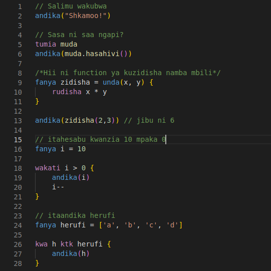

# Nuru VSCode Extension

This is the official vscode extension for Nuru. Supports syntax highlighting on both `.nr` and `.sw` files.

## Screenshots

## Authors

This extension has been authored by [Avicenna](https://github.com/AvicennaJr)
